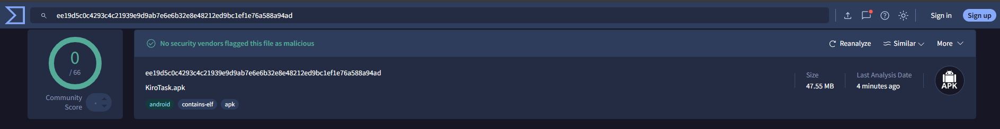

# 📝 KiroTask

KiroTask is a modern and minimal task management app designed to help users stay organized, focused, and productive. It provides a clean interface with powerful features for managing daily tasks efficiently.

---

## ✨ Features

### 📅 Task Calendar
Add, view, and manage tasks per day using a built-in calendar. Days with tasks are color-coded for quick scanning.

### ✏️ Edit & Notes
Each task supports a note field. Easily update task titles and notes anytime.

### 📊 Progress Tracking
Track your daily and monthly productivity with visual progress bars and task completion counters.

### 📌 Pin & Prioritize
Pin important tasks to keep them at the top. Pinned tasks always appear first regardless of status.

### 🌙 Light & Dark Mode
Switch between light and dark themes anytime. Your preference is saved and automatically applied.

### 💾 Save & Undo
Tasks are saved locally using device storage. Accidentally deleted a task? Instantly undo it.

## Download Apps

Link - [Click Here](https://kirotask.vercel.app/)
---